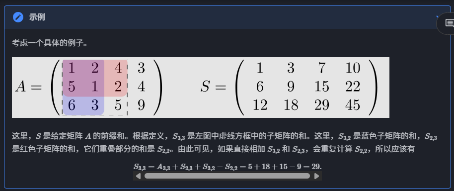
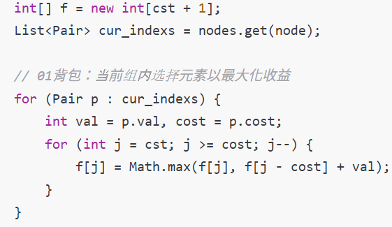
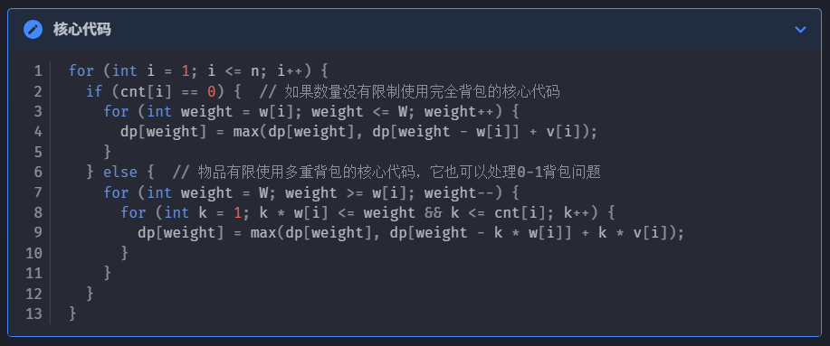
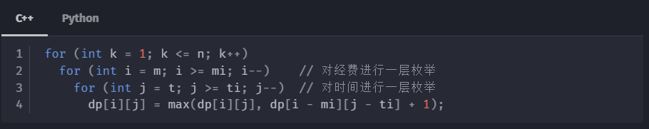
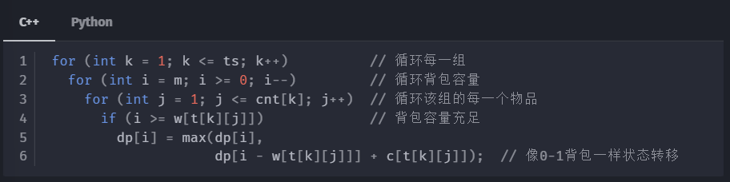

# Coding Review

## Special Structure

1. IP 地址
   1. 对于 IP 增量处理，注意使用:
      1. a[3] = (a[3] + 1) % 256
      2. 这在判断两个 IP 是否连续时非常重要

## 三种距离

1. 三种距离定义
    1. 曼哈顿距离 (L~1~)
    2. 欧几里得距离 (L~2~)
    3. 切比雪夫距离 (L~fin~)
2. 曼哈顿距离和切比雪夫距离
   1. Overview
      1. 经过不同的坐标转化，可以将求切比雪夫距离转化为求曼哈顿距离，反之亦然。
   2. 曼哈顿距离
      1. 与前缀和结合使用，可以O(1)求出所有点到某一点的距离总和
      2. 变换公式:
         1. **(x+y,x-y)**
         2. **原坐标系的曼哈顿距离等于新坐标系的切比雪夫距离**
      3. 便于计算出合适的**中心点**
      4. 典型情景
         1. 便于用在k-medians/聚类
         2. 对异常值的敏感度低于L2，可用于鲁棒统计
   3. 切比雪夫距离
      1. 变换公式:
         1. ((x+y)/2,(x-y)/2)
         2. **原坐标系中的切比雪夫距离等于新坐标系中的曼哈顿距离**
      2. 在排序后可以便利地求出两坐标差的**最大值**
      3. 典型情景
         1. 8‑邻接栅格路径规划（带对角移动的国际象棋棋盘）

## Array

1. Array类别
   1. int[]
   2. List (接口)
2. 适用范围
   1. int[]
      1. int[] 是固定空间，适合只需要改变元素大小的情况。如果需要增删，则不得不重新分配一块内容。
      2. 排序使用Arrays.sort(int[], Comparator)
      3. 初始化方式
         1. int[] arr = new int[5]; // 所有元素初始化为 0
         2. int[] arr2 = {1, 2, 3}; // 静态初始化
      4. 转字符串方式：Arrays.sort()
      5. 填充方式：Arrays.fill()
   2. List<>
      1. List<>适合需要对外层元素进行增删的情况，使用add(index, element)可以方便地对首尾进行元素添加，**高频头部操作建议改用LinkedList**
      2. 排序使用Collections.sort(List<>, Comparator)
      3. 初始化方式 (注意：List是接口，需要使用实现类初始化)
         1. **ArrayList<>**：基于数组，适合随机访问，增删慢
         2. **LinkedList<>**：基于链表，适合头尾插入/删除，访问慢
      4. 转字符串方式：list.toString()
      5. 填充方式：Collections.fill()
      6. 遍历时修改
         1. 遍历List时不能同时修改它（例如使用remove），推荐使用迭代器

         ```java

         List<Integer> list = new ArrayList<>(Arrays.asList(1, 2, 3, 4, 5));
         Iterator<Integer> iterator = list.iterator();
         while (iterator.hasNext()) {
            int val = iterator.next();
            if (val % 2 == 0) {
               iterator.remove();  // 安全地移除当前元素
            }
         }

         System.out.println(list);  // 输出: [1, 3, 5]
         ```

## 前缀和 & 差分

1. 前缀和
   1. 定义:
      1. 前缀和可以简单理解为【数列前n项的和】，是一种重要的**预处理**方式，能大大降低查询的时间复杂度
      2. C++ 标准库中实现了前缀和函数
   2. 二维/多维前缀和
      
      1. S~i2,j2~ - S~i1-1,j2~ - S~i2,j1-1~ + S~i1-1,j1-1~
2. 差分
   1. 差分是一种和前缀和相对的策略，可以当做是求和的逆运算
3. 前缀和 -> 范围增量
   1. 维护一个 diff[] 和 total_here
   2. 每次需要增量时，在 diff[] 对应的区间头部和尾部分别设置标签 +k 和 -k ，而非对数组范围内每个元素都增加
   3. 遍历时每次移动，令 total_here += diff[i] ，这样就使得**遍历**(例如配合二分答案进行验证)时间复杂度从 O(O^2^) -> O(O)
4. **Note**
   1. 使用前缀和时**注意超出int范围**的情况，尽量考虑使用long

## 公共祖先

## 背包问题

1. **01背包问题**
   1. 状态转移方程:
      1. f~i,j~ = max(f~i-1,j~, f~i-1,j-wi~ + v~i~)
      2. 注意：必须从大到小遍历，否则会导致不同物品被选取多次。
      3. 代码示例
         

      4. 如果从小到大遍历，就会变成**完全背包问题**（同一物品可以选取多次）
2. 多重背包问题
   1. 朴素思想：采用01背包的思路，将k个物品放入待选中
   2. 优化思路：将k进行二进制拆分
      1. 例如 k = 13
      2. log~2~(k~i~ + 1) = 3.8 -> 3
      3. 因此可以将 13 拆分为 2 的[0, 3)次方，以及一个余数（如果k + 1不为2的整数次方），即 [1, 2, 4, 6]，这里（6 = 13 - 1 - 2 - 4）
3. 混合背包
   1. 采用if-else分别处理即可
   2. 示例：
      
4. 二维费用背包
   1. 只需在状态中增加一维存放第二种价值即可
   2. 示例：
      
5. 分组背包
   1. 从「在所有物品中选择一件」变成了「从当前组中选择一件」，于是就对每一组进行一次 0-1 背包就可以了
   2. **注意**：需要将组别放置在最外层，接着是背包容量（递减），最里层是背包中的每一个物品。将组别放在最外层，且中间层是递减的背包容量，就可以保证每次最内层更新涉及的 i-1 状态来自于上一次组别。
   3. 示例代码：
      
